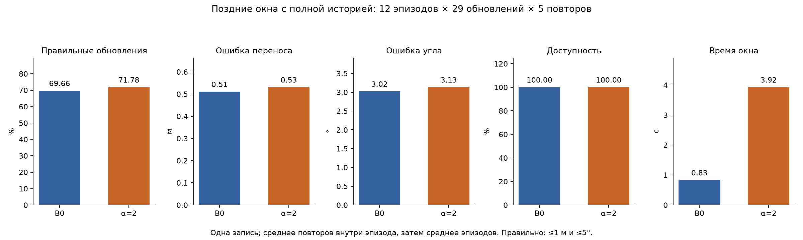

# Воспроизведение и диагностика объектного совмещения TCAFF

**Исследовательский вопрос:** как фиксированная размерная фильтрация влияет на сохранение объектных соответствий и надёжность межроботного совмещения при изменчивой наблюдаемой геометрии?

**Основной результат:** в выбранном ручном пуле B0 исключает 260 из 314 ответов «один объект», но глобальное ослабление размерных ограничений не даёт устойчивого практического выигрыша. Доля правильных обновлений немного растёт; средние ошибки позы, вычислительная стоимость и риск неверного холодного старта ухудшаются. Причины реальных изменений размера ещё не разделены.

TCAFF выбран за доступные авторские наблюдения, явный размерный фильтр и проверяемую цепочку генерации кандидатов и временного отбора. ROMAN рассматривается в [обзоре литературы](docs/related_work.md) как более богатое представление объектов. Его код, данные и зависимости в этот репозиторий не входят; сравнительных запусков ROMAN здесь нет.

## Что выполнено

- Воспроизведён компонент **готовые детекции → картирование → MNO-CLIPPER → временной TCAFF**, с проверкой replay и независимым расчётом относительного GT.
- Подготовлены 24 диагностических эпизода и **полный пакет 798 ручных ответов** с ID, уверенностью, комментариями и промежуточной версией.
- После отдельного подбора α выполнено сравнение одного глобального ослабления с исходным B0 на поздних окнах; холодный старт оценён отдельно.
- Проведены диагностика стадий и модельная проверка изменения размера и центра при идеальном перекрытии.

Авторские алгоритмы находятся в закреплённых submodules [TCAFF](vendor/tcaff) и [CLIPPER](vendor/clipper). Собственные скрипты и явно обозначенная адаптация demo отделены от upstream; [происхождение и diff](docs/provenance.md).

## Главный эксперимент

**Поздние окна с полной историей:** 12 эпизодов × 29 обновлений × 5 случайных повторов. Каждый фильтр работает от начала записи. Правильная поза: ошибка переноса ≤1 м **и** угла ≤5°. Усредняются повторы внутри эпизода, затем эпизоды.

| Метрика | B0 | α=2 |
|---|---:|---:|
| Правильные обновления / все обновления | 1212/1740 = 69.66% | 1249/1740 = 71.78% |
| Средняя ошибка переноса | 0.5103 м | 0.5305 м |
| Средняя ошибка угла | 3.0217° | 3.1319° |
| Доступность оценки | 100% | 100% |
| Среднее время обработки окна | 0.8291 с | 3.9250 с — ×4.73 |



**Холодный старт — отдельная диагностика:** неверное первое решение **4/60 → 10/60 (6.67% → 16.67%)**; правильная инициализация до конца окна **20/60 → 30/60**. Отсутствие первого решения **40/60 → 25/60**. Это сброс состояния фильтра, а не начало новой записи. [Методика и все результаты](report.md), [таблица доказательств](results/evidence.csv).

## Следующая гипотеза — не проверена

Совместный учёт неопределённости наблюдаемого размера и центра позволит сохранять полезные соответствия частично видимых объектов без увеличения частоты ложного совмещения относительно B0 и глобального ослабления. Предлагается проверять совместную надёжность пары перед MNO, включая отдельную оценку возможного смещения центра. Механизм **не реализован**, эффективность и научная новизна **не установлены**. [Предложение и критерий опровержения](report.md#8-следующая-гипотеза-и-будущая-проверка).

## Границы выводов

Одна запись четырёх роботов; направления, кадры, окна и повторы зависимы. Ручной пул специально отобран по потере геометрической поддержки, поэтому его доли не оценивают частоту проблемы во всей записи. Маски и семантические классы исходных сегментов отсутствуют. Разметка содержит неоднозначность коробок/групп и динамические признаки. Полный нейросетевой frontend и MOT/MOTA не воспроизводились. Модель перекрытия показывает возможный механизм, но не устанавливает причины реальных отказов.

## Два пути чтения и воспроизведения

**A. Без датасета и без сторонних Python-пакетов:** из корня репозитория:

```bash
python3 scripts/inspect_saved.py
python3 scripts/read_annotations.py --task P0002
python3 scripts/read_annotations.py --html /tmp/tcaff-labels.html
```

Проверяются исходные файлы меток и CSV, подсчёт решений размерного фильтра и агрегация сохранённых ошибок. Готовые рисунки доступны сразу; команды их восстановления — в [инструкции](docs/reproduction.md#a-проверка-сохранённых-результатов). Новые эксперименты при этом не запускаются.

**B. С внешними авторскими данными:** отдельное получение данных, закреплённые зависимости, запуск baseline и замороженной размерной абляции описаны в [docs/reproduction.md](docs/reproduction.md). Для точного повторения прежней абляции нужны также внешний исследовательский snapshot карт и приватного пакета отбора. Ничего не скачивается автоматически. Установка с нуля не проверена; рабочее окружение и перенос команд проверены.

Канонический научный текст — [report.md](report.md). Дополнительно: [разметка](docs/annotation.md), [литература](docs/related_work.md), [план со статусами](research_plan.md), [источники кода и результатов](docs/provenance.md), [внешние данные](data/README.md), [проверки подготовки](docs/validation.md).

Подготовлено локально 9 октября 2026 года. Публикация не выполнялась. Лицензия собственного исследовательского кода ещё не выбрана; лицензии upstream сохранены.
