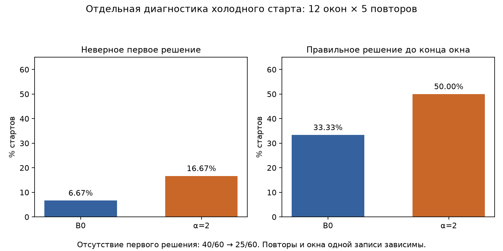
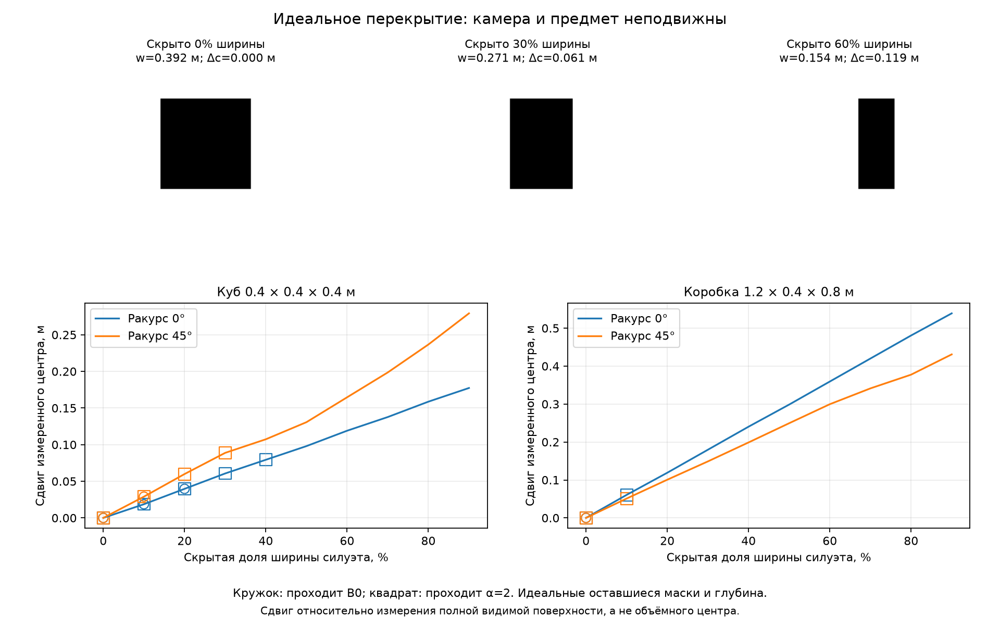

# Размерная фильтрация и изменчивость наблюдаемой геометрии в объектном совмещении TCAFF

Канонический исследовательский отчёт, 9 октября 2026 года. Сводные цифры прослеживаются через [таблицу доказательств](results/evidence.csv); воспроизведение описано [отдельно](docs/reproduction.md).

## 1. Постановка и результат

Межроботное совмещение по объектам требует одновременно распознать соответствующие ориентиры и получить геометрически согласованные точки. Наблюдения одного предмета могут давать разные размеры и центры. Жёсткий допуск теряет соответствия; расширение допуска может вернуть геометрически ненадёжные пары и увеличить неоднозначность поиска. Исследовательский вопрос — какой компромисс реализует размерный фильтр TCAFF и достаточно ли его глобально ослабить.

В выполненной проверке **глобального ослабления недостаточно для устойчивого практического выигрыша**. Ручные ответы подтверждают потерю пар с одинаковой физической идентичностью в специально выбранном пуле. Их возвращение слегка повышает долю правильных обновлений на поздних окнах, одновременно ухудшая средние ошибки, время и неверные первые решения при холодном старте. Это отрицательный результат проверенной модификации, а не утверждение о бесполезности TCAFF.

Следующий вопрос шире конкретного порога: **когда одинаковая физическая идентичность действительно обеспечивает сопоставимость наблюдаемой геометрии?** Уточнённая гипотеза рассматривает совместную надёжность размера и центра; она ещё не проверена.

## 2. Отношение к современным подходам

[Анализ пяти работ](docs/related_work.md) отделяет три уровня: накопление объектной геометрии, поиск глобальных ассоциаций и временной выбор позы. TCAFF — ICRA 2025; ROMAN — RSS 2025; Khronos — RSS 2024. Hickory (2026) и Distribution Estimation for Global Data Association via Approximate Bayesian Inference (2025) рассматриваются как препринты: подтверждения принятия в конференцию не найдено.

Наше отличие — не добавление семантики или объединения сегментов: такие механизмы уже существуют. Мы проверяем связь между идентичностью предмета, сопоставимостью его видимой геометрии и конечным риском совмещения. Более богатое представление и многогипотезный поиск дают способы работать с этой неопределённостью, но не позволяют автоматически считать все возвращённые пары полезными. Это **исследовательская интерпретация**, а не доказательство отсутствия решения во всей литературе. Новизна предлагаемого механизма не установлена. Эксперименты проекта не проверяют отказы ROMAN, Khronos или Hickory.

## 3. B0: область воспроизведения и проверка кода

Воспроизведена цепочка **готовые авторские FastSAM-детекции → исходное картирование → размерный допуск → MNO-CLIPPER → временной TCAFF**. Полный путь RGB-D → нейросети → MOT/MOTA не воспроизведён. В размерной абляции входом служат уже замороженные карты: повторного картирования нет.

Проверенный TCAFF: `ff4ceab04b03fecabc4de9c9cbe7dbba4ab50df9`; CLIPPER: `e514dc29c273837ffdfeebbefbdcb2a93d970969`. [Исходные функции и diff адаптации](docs/provenance.md#исходный-код-и-границы-адаптации).

Подтверждено кодом:

- `depth_mask_2_centroid` использует медианную метрическую глубину RGB-D внутри маски и средний пиксель маски; `mask_depth_2_width_height` проецирует границы её 2D bounding box на эту глубину. Это размеры видимого сегмента, а не восстановленного физического объёма.
- `TCAFFManager.get_putative_assoc` проверяет отношения и абсолютные различия ширины/высоты. `get_frame_align_measurements` передаёт в геометрию **XY-центры**. Допуск пары ещё не означает выбор CLIPPER или подтверждённую позу.
- `FrameAligner` требует минимум 5 соответствий для успешной подгонки и использует возрастные веса. Release `max_opt_fraction=0.75`; значение 0.5 в аргументах класса не является конфигурацией основного эксперимента.
- В `Node.mahalanobis_diff` возвращается `q=rᵀS⁻¹r`, а `Node.nlml` использует `q²`. Это отличается от гауссовского члена `q` в формуле статьи. В B0 различие сохранено. Исправление стоимости и объединение объектов в размерный эксперимент не включены.
- Готовые JSON не сохраняют исходные маски или семантические классы. Нельзя вывести идентичность из центра, трекового ID, эллипса ковариации или правильной общей позы.

Последнее наблюдение не означает, что в полном TCAFF отсутствуют любые способы учитывать динамику: картирование и временной фильтр уже действуют. В воспроизведённом размерном допуске нет проверки семантического класса «робот/человек».

## 4. Данные, GT и единицы оценки

Доступна одна авторская запись: четыре робота RR01/RR04/RR06/RR08, шесть пешеходов, статические коробки в помещении 10×10 м. Этот состав описан в README датасета; независимой дополнительной записи нет. Данные остаются внешними, [получение и состав](data/README.md).

GT относительного преобразования систем одометрии определяется по mocap и одометрии:

`T_GT = T_odom_i_robot_i · inverse(T_world_robot_i) · T_world_robot_j · inverse(T_odom_j_robot_j)`.

Для ошибки используется `inverse(T_GT_SE2) · T_EST_SE2`: норма XY-переноса в метрах и модуль угла yaw, приведённого к [−π,π], в градусах. Ошибки усредняются по принятым оценкам с доступным GT; доступность выводится отдельно. GT используется при оценке и диагностическом отборе, **не для онлайн-подтверждения** каждой пары в алгоритме.

337 обновлений × 12 направленных пар = 4044 зависимых обновления. Основной baseline усредняет средние ошибки каждой направленной пары. Поздние окна используют другую агрегацию: среднее повторов внутри эпизода, затем среднее эпизодов. Их нельзя объединять в одну среднюю или сравнивать напрямую с полной записью. Число независимых записей равно одному; 12 направлений не означают 12 независимых экспериментов.

## 5. Ручная диагностика и протокол модификации

До эксперимента зафиксированы [протокол](configs/size_gate_study.json), SHA кода, карт и пакет разметки. Выбраны 24 якоря: до фильтра максимальное взаимно однозначное сопоставление центров в GT-преобразовании, XYZ-радиус 0.6 м, содержит ≥5 пар; после размерного допуска — <5. По четыре якоря на шесть канонических пар, разнесённые минимум на 40 обновлений; включены успешные совмещения, отсутствие решения и эпизод с неверным первым решением.

Прокси не является разметкой идентичности и не является кликой CLIPPER. Предыдущие 259 из 1893 GT-валидных геометрических кадров с потерей поддержки относятся к отдельному аудиту. Они **не знаменатель** ручных результатов. Дополнительный аудит XY показал, что 3D-отбор может недооценивать поддержку плоского алгоритма: после B0 совместимая пятёрка в XYZ отсутствовала на всех 24 якорях, а в XY сохранялась на 6/24. Исходный отбор задним числом не менялся; [сохранённая диагностика](results/diagnostics/dimension_audit.json).

Ручной пул содержит все 798 близких пар на этих якорях, в том числе допущенные и близкие альтернативы. В первичном интерфейсе скрывались решение фильтра, размеры, результат совмещения и split. 314 ответов `same_object`, 341 `different_objects`, 67 `part_whole_or_ambiguous`, 76 `cannot_tell`. Единица — **ответ на пару наблюдений карты в одном якоре**; это не 798 независимых предметов и не 314 уникальных объектов. [Полная схема, версии и оговорки](docs/annotation.md).

Для каждого канонического направления два ранних якоря — development, два поздних — holdout: 12+12 эпизодов. Development-окна заканчиваются не позже шага 150; holdout начинаются не раньше 170. Holdout ранее просматривался при диагностике: это отложенная часть для нового подбора параметра, **не новая сцена и не полностью невиденные данные**.

Менялись только два допуска, совместно:

`wh_scale_diff(α)=1+α·(1.35−1)`, `h_diff(α)=α·0.1 м`.

Для каждой из ширины и высоты требуется **и** `max≤min·wh_scale_diff`, **и** `|difference|≤h_diff`. При α=2 это отношение 1.7 и разность 0.2 м. Основной фильтр B0 соответствует α=1. Рассмотрены 1.25, 1.5, 2 на development, по 5 повторов, с неизменным `random_device` CLIPPER. Правило выбора: не увеличить среднее число неверных первых решений относительно B0; затем максимизировать инициализацию до конца окна, минимизировать неверные первые решения, максимизировать правильные обновления и выбрать меньший α при равенстве. Выбран α=2; [selection](results/size_gate/selection.json), [development](results/size_gate/development.json). Выбор заморожен до нового чтения holdout-результатов.

Сохранены 420 прогонов: 240 ранних холодных стартов, 120 поздних холодных стартов и 60 полных историй (6 канонических пар × 2 варианта × 5 повторов). Параметры прочих компонентов, карты, стоимость и треки не менялись. [Компактные метрики всех прогонов](results/size_gate/run_metrics.json.gz); исходные карты, предложения и состояния остаются во внешнем snapshot.

## 6. Результаты

### 6.1. Исходный компонент совмещения

| Метрика полной записи, release τ=9 | Значение |
|---|---:|
| Среднее средних пар: перенос | 0.437904 м |
| Среднее средних пар: угол | 2.446127° |
| Доступность | 3598/4044 = 88.9713% |
| Несовпадения replay | 0/4044 |
| Максимальное численное отклонение replay | 8.88×10⁻¹⁶ |
| Максимальное отклонение независимой композиции GT | 5.33×10⁻¹⁵ |

Это близко к 0.43 м / 2.3° в [TCAFF, IV-C](https://arxiv.org/html/2405.05210v3), но не является точным повторением статьи. Там τ=8, в release `main_tree_obj_req=9`. Контроль τ=8 прогнал **только временной фильтр на тех же сохранённых предложениях**, все 4044 обновления; ошибки и доступность совпали. Новый frontend, картирование или MNO в этом контроле не запускались. [Audit](results/baseline/audit.json), [сохранённые ошибки](results/baseline/error_traces.json.gz).

### 6.2. Какие ручные ответы исключены

| Ответ пользователя | Всего | B0 исключает | B0 допускает | α=2 допускает |
|---|---:|---:|---:|---:|
| Один объект | 314 | 260 | 54 | 124 |
| Разные объекты | 341 | 304 | 37 | 101 |
| Часть/целое или неоднозначно | 67 | см. [подсчёт](results/size_gate/label_counts.json) | — | — |
| Невозможно установить | 76 | см. [подсчёт](results/size_gate/label_counts.json) | — | — |

Среди `same_object` высокой уверенности B0 исключает **178/220**. Глобальное ослабление возвращает дополнительно **70 записанных пар «один объект» и 64 «разные объекты»**. Это действия допуска, не число ложных итоговых поз. Высокая уверенность — ответ одного разметчика, не независимая верификация физических ID.

### 6.3. Поздние окна с полной историей — основной результат

Каждый вариант запускается от начала записи; поздние 29-шаговые окна оценивают уже накопленное состояние. Замороженный B0 используется как контекст, стохастические повторные B0 — как парное сравнение с α=2. Принятое решение в начале позднего окна не является новой инициализацией.

| Метрика | Повторный B0 | α=2 |
|---|---:|---:|
| Правильные обновления | 1212/1740 = 69.66% | 1249/1740 = 71.78% |
| Перенос, средняя ошибка | 0.5103 м | 0.5305 м |
| Yaw, средняя ошибка | 3.0217° | 3.1319° |
| Доступность | 1740/1740 = 100% | 1740/1740 = 100% |
| Среднее время окна | 0.8291 с | 3.9250 с |

Рост доли правильных обновлений — **2.13 процентного пункта**, при росте ошибок и времени **в 4.73 раза**. Замороженный B0 в тех же окнах: 70.4023%, 0.506828 м / 3.003515°. Стохастическое повторение B0 не заменяет этот исходный артефакт. [Полная сводка](results/size_gate/full_history.json).

Время — сумма `perf_counter` вокруг `manager.update`, затем та же агрегация повторов и эпизодов. Входит поиск MNO и временной фильтр; загрузка файлов, подсчёт допущенных пар, replay-проверка и запись JSON находятся вне измеряемой секции. Одинаковые CPU и однопоточные BLAS/OpenMP; частота CPU не фиксировалась. Число кандидатов и внутренние выделения памяти входят в стоимость менеджера. Это не время полного RGB-D frontend и не гарантированная частота онлайн-работы.

### 6.4. Холодный старт — отдельный протокол

Оба фильтра сбрасываются в начале одинаковых сохранённых окон; картирование не сбрасывается. 12 holdout-окон × 5 повторов = 60 зависимых стартов на вариант.

| Метрика | B0 | α=2 |
|---|---:|---:|
| Неверное первое принятое решение | 4/60 = 6.67% | 10/60 = 16.67% |
| Нет первого решения | 40/60 | 25/60 |
| Хотя бы одна правильная оценка до горизонта | 20/60 | 30/60 |
| Среднее ограниченное время до правильной оценки | 24.1666 с | 21.5666 с |

Последняя строка ограничивает неуспешные случаи концом окна (примерно 28 с), то есть сохраняет правое цензурирование. Это описательное capped-время, не несмещённая оценка времени до успеха и не среднее только успешных стартов. Рост правильной инициализации сопровождается ростом ложной; [исходная сводка](results/size_gate/cold_start.json). Проверка 12 комбинаций порогов на этих холодных стартах дала 2 выигрыша, 9 ухудшений и 1 равенство по доле правильных обновлений; это чувствительность определения, не новый подбор α: [сохранённый аудит](results/diagnostics/threshold_diagnosis.json).

### 6.5. Модель перекрытия

Неподвижные камера и предмет. Точные лучевые пересечения кубоида дают идеальную видимую маску и глубину; экран исключает левую либо верхнюю долю bounding box. Исходные функции TCAFF вычисляют дескрипторы; `get_putative_assoc` проверяет пару. 2 формы × 2 ракурса × 2 направления × 10 уровней = **80 зависимых случаев**, включая 8 нулевых контролей.

Для куба 0.4 м, фронтального ракурса и левого экрана:

| Скрытая доля ширины силуэта | Наблюдаемая ширина | Сдвиг измеренного центра | B0 / α=2 |
|---|---:|---:|---|
| 0% | 0.3920 м | 0 | допускает / допускает |
| 30% | 0.2707 м | 0.0607 м | исключает / допускает |
| 60% | 0.1540 м | 0.1190 м | исключает / исключает |

Сдвиг отсчитывается от измерения полной видимой поверхности, **не от объёмного центра**. Доля закрытой ширины bounding box отличается от удалённой площади маски. FastSAM, картирование, MNO-решение и временной TCAFF с этими новыми измерениями не запускались. Модель подтверждает возможность механизма, но не его частоту и не причинную роль в реальной записи. [80 случаев](results/occlusion/cases.json); при проверке переноса все совпали численно, [протокол](results/model_checks.json).

### 6.6. Дополнительная диагностика и прежние отрицательные результаты

В 632 историях с ≥5 исходными наблюдениями размах p10–p90 размеров пересекает допуск B0 в 420 случаях, первое/последнее измерение — в 384. Это 696 снимков истории для 605 ID; вариативность может отражать ракурс, сегментацию, динамику или ошибку ассоциации: [сводка](results/diagnostics/source_size_stability.json). При замене размера карты последним исходным измерением 173 из 178 исключённых `same_object/high` остаются исключёнными; 5 восстанавливаются, 7 ранее допущенных теряются: [диагностика сглаживания](results/diagnostics/smoothing_diagnosis.json). Это пассивный анализ размеров, не улучшенный алгоритм.

Историческая проверка правил принятия B0/B3 дала те же **3 неверных первых решения из 12 направлений**; [сохранённая таблица](results/history/decision_rules_summary.txt). Историческое увеличение MNO 4→16 на шести канонических парах дало правильные/неверные/отказы **4/1/1 → 2/3/1**; [сводка](results/history/h7_summary.json), [конфигурация](configs/historical_h7.json). Это другие протоколы, сокращённые префиксы и экспериментальные правила; их исторический ярлык B0 нельзя подставлять вместо release-baseline раздела 6.1. Использовавшийся seeded-helper отличается от исходного `random_device`. Эти проверки не подтверждают текущую гипотезу о неопределённости.

## 7. Интерпретации и угрозы валидности

**Факт:** фильтр исключает многие записанные метки «один объект» в обогащённом пуле и предотвращает множество пар «разные объекты». **Интерпретация:** полезность возвращённой пары зависит от того, насколько её центры являются одной физической точкой. Отрицательная абляция согласуется с этой проблемой, но не доказывает, что именно смещение центров вызвало ухудшение.

Основные ограничения: одна сцена; зависимые окна; ранее просмотренный holdout; один разметчик; отсутствующие маски и физические ID; смешение коробок и групп; неподтверждённая статичность всех признаков; сохранённое расхождение стоимости с гауссовской формулой; стохастический поиск. Гиперпараметры выбирались отдельно по времени, но переносимость на новую запись не оценена. Статистическая значимость не заявляется.

Одновременно наблюдаемые одинаковые роботы могут обозначать **разные физические роботы**. Встречное наблюдение двух роботов не является наблюдением одного неподвижного ориентира; случайно правильная поза не подтверждает идентичность признака. Для нескольких одинаковых роботов неоднозначность усиливается. Разметка пользователя не была автоматически переписана после этой оговорки.

Коробки в плотных группах иногда размечались как отдельные предметы, иногда как один объект с низкой уверенностью или часть/целое с высокой. Стол и светильник могут поддерживать похожую XY-геометрию из доступных ракурсов, оставаясь разными предметами. Эти особенности требуют явных физических ID в будущем, а не подгонки ответов под результат алгоритма.

Выбранные реальные примеры P0002/P0034/P0026/P0179 доступны через [метаданные](annotations/examples.json) и [локальную сборку](docs/annotation.md#реальные-иллюстрации). Они показывают исключённую пару, допущенный отрицательный контроль и неопределённые случаи. Для P0002 отмечены роботоподобные сегменты и ответ пользователя «разные ракурсы»; это иллюстрация ответа и ограничения идентичности, не независимое подтверждение статического ориентира. Эллипсы не заменяют маски. Авторские изображения в репозиторий не включены: разрешение на их распространение не установлено.

## 8. Следующая гипотеза и будущая проверка

**Гипотеза:** совместный учёт неопределённости наблюдаемого размера и центра позволит сохранять полезные соответствия частично видимых объектов без увеличения частоты ложного совмещения относительно фиксированного фильтра и его глобального ослабления. **Статус:** не реализована, не проверена; новизна не установлена.

**Один минимальный механизм — совместный допуск надёжности перед MNO.** Для каждого наблюдения RGB-D с маской оценивать интервалы сопоставимого размера, ковариацию случайного шума центра и отдельную верхнюю границу его возможного систематического смещения. Предиктор калибруется на статических предметах с физическими ID и известной геометрией/перекрытием. Входные признаки: обрезка маски границей кадра, доступные глубины, согласованность видимых плоскостей и ракурса; история используется только после независимой проверки ассоциации.

В `get_putative_assoc` предлагается возвращать ранее потерянную пару лишь при совместимости интервалов размера **и** достаточно малой суммарной границе ошибки двух центров. Например, `sqrt(trace(Σ_i))+sqrt(trace(Σ_j))+B_i+B_j ≤ δ`, где Σ описывает случайный шум, B — отдельно калиброванное смещение относительно общей физической опорной точки, δ выбирается только на development. Это консервативный отказ от ненадёжной геометрии, а не реконструкция невидимых поверхностей. MNO, его ε, временной фильтр и стоимость в первом сравнении остаются одинаковыми. Именно входной допуск использует оценку; доверие не назначается по GT в рабочем запуске.

Здесь есть проверяемый барьер: может оказаться, что без наблюдаемости общей опорной точки нельзя оценить B достаточно точно, и правило почти не возвращает пары. Простое увеличение ковариации не исправляет смещение. Разброс истории может быть следствием смены предмета, ошибки трекинга или сегментации; он не является готовой оценкой перекрытия. Физический prior кубоида ограничивает область применения и не должен считаться универсальным.

**Будущий протокол:**

1. Собрать контролируемые RGB-D наблюдения статических предметов: физические ID, эталонная опорная точка/размер, известные ракурсы и уровни перекрытия. Отделить обрезку кадром, внешний экран, ошибки маски и смену ракурса. Проверить калибровку интервалов и B на отдельных предметах.
2. Получить независимую запись другой сцены/проезда для конечного совмещения. Сейчас такой записи нет. Разделить подбор и оценку по записи, а не по направлению пары.
3. Сравнить B0, один глобальный допуск, учёт только размера и совместный размер/центр. Одинаковые остальные настройки, число повторов и бюджет поиска; без незаметного исправления стоимости или объединения объектов.
4. Оценить ошибки позы вместе с доступностью, неверное первое решение, долю правильной инициализации и цензурированное время до неё, стоимость и число кандидатов. Идентичность и пригодность пары для геометрии оценивать раздельно.
5. **Опровергнуть гипотезу**, если на независимой записи нет выигрыша при сопоставимом риске ложных решений, интервалы некалиброваны либо вычислительная стоимость неприемлема для заданного бюджета. Допустимый риск и бюджет зафиксировать до оценки.

Это следующий этап исследования, а не необходимое условие завершения данного репозитория. Численное улучшение и срок его получения не обещаются.

## 9. Собственный вклад и воспроизводимость

Авторские TCAFF/CLIPPER не являются нашим вкладом. Вклад проекта: воспроизведение компонента, проверка GT/replay, диагностический отбор, интерфейс и полный набор ручных ответов, фиксированная абляция с раздельным подбором, анализ стадий и идеальная модель механизма. Переоформление графиков не выдаётся за новые прогоны. [Контрольные суммы и происхождение](docs/provenance.md), [проверки подготовки](docs/validation.md).

Человек выполнил ручную разметку и уточнил её ограничения. Codex использовался для подготовки окружения, скриптов, проверок, анализа источников и черновиков отчёта. Экспериментальные результаты и ответы сохранены; помощь ИИ не является независимой экспертизой или вторым разметчиком.
